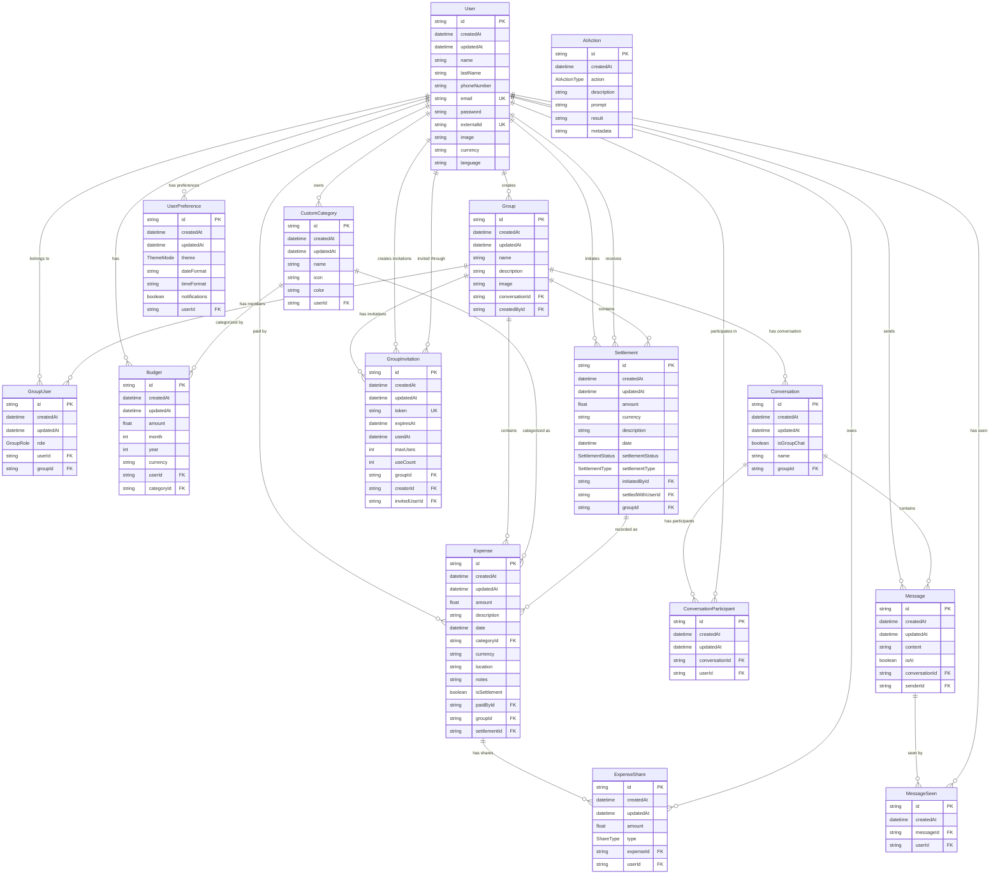

# Prisma Schema - Mermaid ER Diagram

## Enums

### GroupRole
- ADMIN
- MEMBER  
- GUEST
- ASSISTANT

### ShareType
- EQUAL
- PERCENTAGE
- FIXED

### SettlementStatus
- PENDING
- PENDING_CONFIRMATION
- CONFIRMED
- COMPLETED
- CANCELLED

### SettlementType
- PAYMENT
- RECEIPT

### AIActionType
- EXPENSE_CREATE
- EXPENSE_UPDATE
- GROUP_CREATE
- PAYMENT_RECORD

### ThemeMode
- LIGHT
- DARK
- SYSTEM
