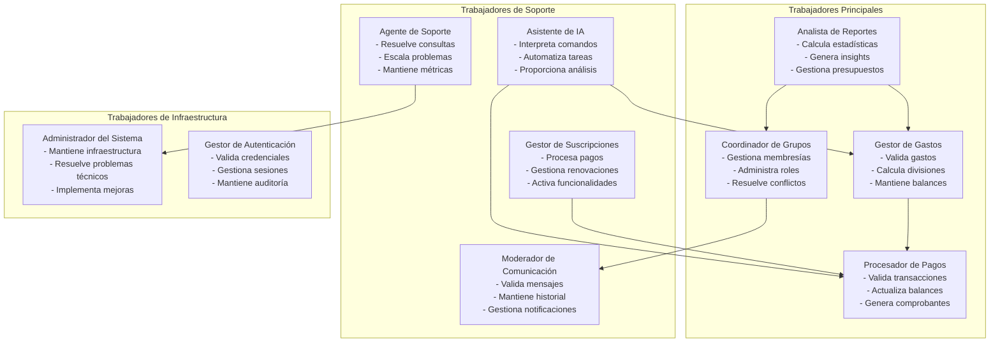
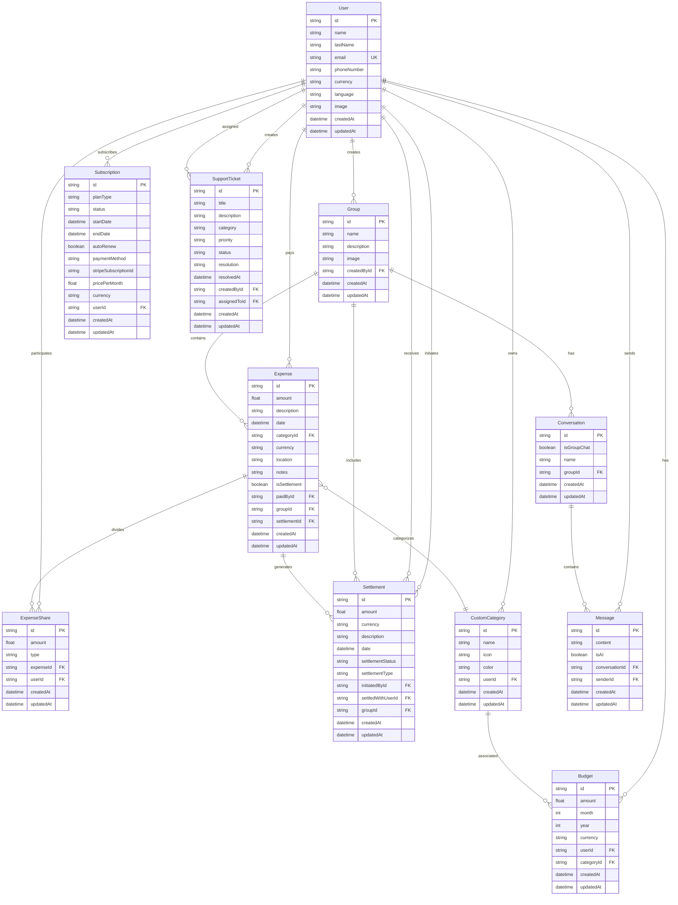
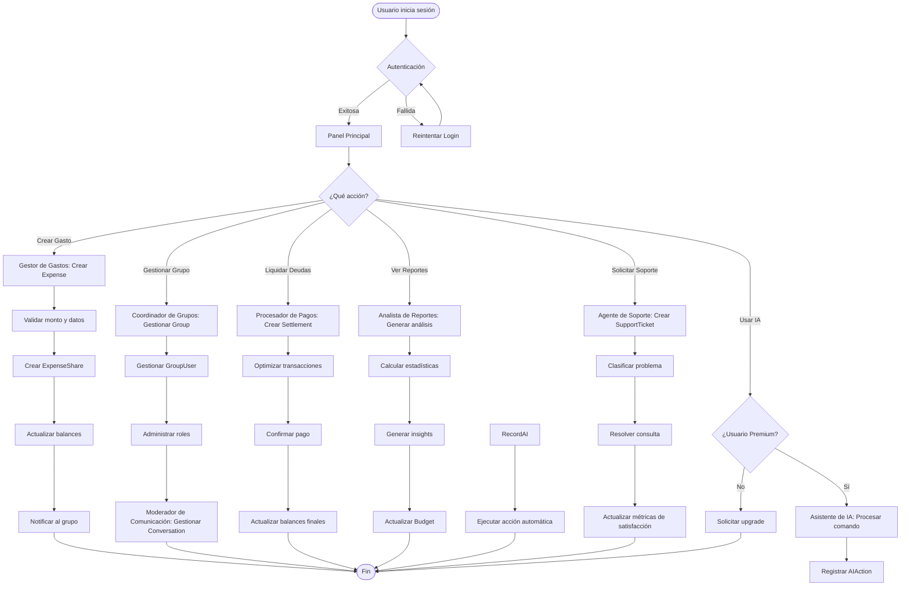
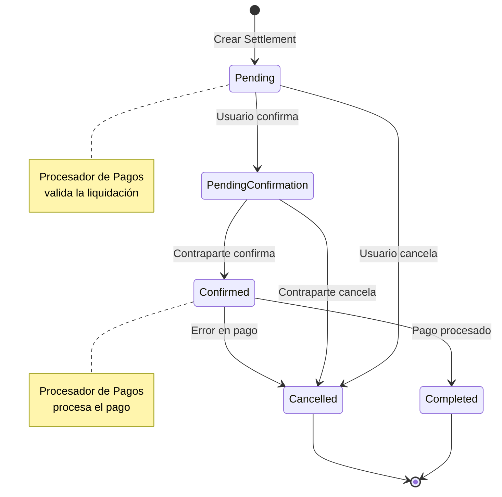
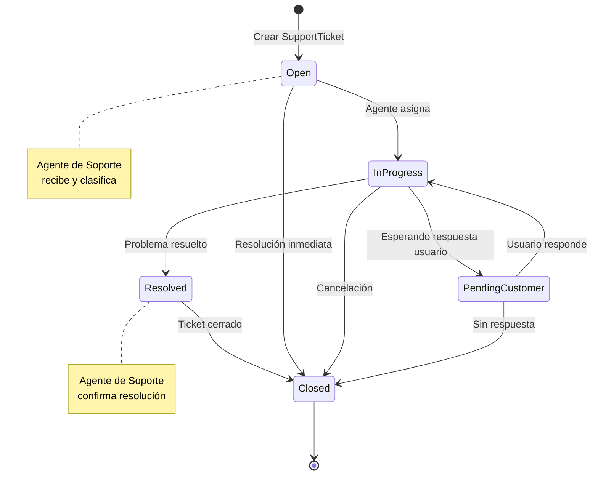

# Trabajadores y Entidades del Negocio - Splitia

## Índice
1. [Trabajadores del Negocio](#1-trabajadores-del-negocio)
2. [Entidades del Negocio](#2-entidades-del-negocio)
3. [Relaciones entre Trabajadores y Entidades](#3-relaciones-entre-trabajadores-y-entidades)
4. [Diagramas de Arquitectura](#4-diagramas-de-arquitectura)

---

## 1. Trabajadores del Negocio

### 1.1 Trabajadores Principales

#### **Gestor de Gastos (Expense Manager)**
- **Responsabilidad Principal**: Gestionar el ciclo completo de gastos compartidos
- **Tareas Específicas**:
  - Validar la creación de gastos (monto > 0, división completa)
  - Calcular divisiones equitativas (igual, porcentual, fijo)
  - Mantener balances actualizados en tiempo real
  - Generar propuestas de liquidación optimizadas
  - Verificar integridad de datos financieros
- **Entidades que Gestiona**: `Expense`, `ExpenseShare`, `Settlement`
- **Reglas de Negocio Aplicadas**: RB-007, RB-008, RB-009, RB-024

#### **Coordinador de Grupos (Group Coordinator)**
- **Responsabilidad Principal**: Administrar la membresía y configuración de grupos
- **Tareas Específicas**:
  - Validar invitaciones y membresías
  - Gestionar roles y permisos (ADMIN, MEMBER, GUEST, ASSISTANT)
  - Mantener integridad de datos del grupo
  - Resolver conflictos de membresía
  - Gestionar conversaciones grupales
- **Entidades que Gestiona**: `Group`, `GroupUser`, `GroupInvitation`, `Conversation`
- **Reglas de Negocio Aplicadas**: RB-004, RB-005, RB-006, RB-019

#### **Procesador de Pagos (Payment Processor)**
- **Responsabilidad Principal**: Gestionar transacciones y liquidaciones
- **Tareas Específicas**:
  - Validar pagos entre usuarios
  - Actualizar balances automáticamente
  - Generar comprobantes de liquidación
  - Manejar reembolsos y cancelaciones
  - Optimizar transacciones para minimizar pagos
- **Entidades que Gestiona**: `Settlement`, `SubscriptionPayment`
- **Reglas de Negocio Aplicadas**: RB-011, RB-012, RB-013, RB-014

#### **Analista de Reportes (Report Analyst)**
- **Responsabilidad Principal**: Generar análisis y reportes financieros
- **Tareas Específicas**:
  - Calcular estadísticas de gastos personales y grupales
  - Generar reportes personalizados por usuario
  - Mantener métricas de uso de la plataforma
  - Proporcionar insights financieros
  - Gestionar presupuestos y categorías personalizadas
- **Entidades que Gestiona**: `Budget`, `CustomCategory`, `Expense`
- **Reglas de Negocio Aplicadas**: RB-015, RB-016, RB-017, RB-018

### 1.2 Trabajadores de Soporte

#### **Moderador de Comunicación (Communication Moderator)**
- **Responsabilidad Principal**: Gestionar la comunicación dentro de grupos
- **Tareas Específicas**:
  - Validar mensajes y contenido
  - Mantener historial de conversaciones
  - Gestionar notificaciones en tiempo real
  - Resolver problemas de comunicación
  - Moderar contenido inapropiado
- **Entidades que Gestiona**: `Message`, `Conversation`, `MessageSeen`
- **Reglas de Negocio Aplicadas**: RB-019, RB-020

#### **Asistente de IA (AI Assistant)**
- **Responsabilidad Principal**: Proporcionar asistencia inteligente a usuarios premium
- **Tareas Específicas**:
  - Interpretar comandos en lenguaje natural
  - Crear gastos automáticamente
  - Generar liquidaciones optimizadas
  - Proporcionar análisis predictivos
  - Automatizar tareas repetitivas
- **Entidades que Gestiona**: `AIAction`, `Expense`, `Settlement`
- **Reglas de Negocio Aplicadas**: Todas las reglas aplicables según el contexto

#### **Gestor de Suscripciones (Subscription Manager)**
- **Responsabilidad Principal**: Gestionar planes premium y pagos
- **Tareas Específicas**:
  - Procesar suscripciones premium
  - Gestionar renovaciones automáticas
  - Manejar métodos de pago
  - Activar/desactivar funcionalidades premium
  - Gestionar facturación
- **Entidades que Gestiona**: `Subscription`, `SubscriptionPayment`
- **Reglas de Negocio Aplicadas**: Reglas específicas de facturación

#### **Agente de Soporte (Support Agent)**
- **Responsabilidad Principal**: Brindar atención al cliente y soporte técnico
- **Tareas Específicas**:
  - Recibir y clasificar tickets de soporte
  - Resolver consultas y problemas técnicos
  - Escalar problemas complejos
  - Gestionar disputas entre usuarios
  - Mantener métricas de satisfacción
- **Entidades que Gestiona**: `SupportTicket`, `SupportMessage`, `SupportAttachment`
- **Reglas de Negocio Aplicadas**: Reglas de escalamiento y resolución

### 1.3 Trabajadores de Infraestructura

#### **Administrador del Sistema (System Administrator)**
- **Responsabilidad Principal**: Mantener la infraestructura y seguridad
- **Tareas Específicas**:
  - Mantener la infraestructura de la plataforma
  - Resolver problemas técnicos críticos
  - Gestionar la base de datos
  - Implementar mejoras y actualizaciones
  - Monitorear rendimiento y seguridad
- **Entidades que Gestiona**: Todas las entidades del sistema
- **Reglas de Negocio Aplicadas**: RB-021, RB-022, RB-023, RB-025, RB-026

#### **Gestor de Autenticación (Authentication Manager)**
- **Responsabilidad Principal**: Gestionar la seguridad y autenticación
- **Tareas Específicas**:
  - Validar credenciales de usuario
  - Gestionar sesiones y tokens
  - Implementar autorización por roles
  - Mantener auditoría de cambios
  - Gestionar preferencias de usuario
- **Entidades que Gestiona**: `User`, `UserPreference`
- **Reglas de Negocio Aplicadas**: RB-001, RB-002, RB-003, RB-021, RB-022, RB-023

---

## 2. Entidades del Negocio

### 2.1 Entidades Principales

#### **Usuario (User)**
- **Propósito**: Representar a una persona en el sistema
- **Atributos Clave**:
  - `id`: Identificador único
  - `name`, `lastName`: Nombre completo
  - `email`: Email único para autenticación
  - `phoneNumber`: Teléfono opcional
  - `currency`: Moneda por defecto (PEN)
  - `language`: Idioma por defecto (es)
  - `image`: Avatar del usuario
- **Reglas de Negocio**:
  - Email único en el sistema (RB-001)
  - Debe tener al menos nombre y apellido (RB-002)
  - Moneda y idioma por defecto configurables (RB-003)
- **Relaciones**:
  - Pertenece a múltiples grupos (`GroupUser`)
  - Crea y paga gastos (`Expense`)
  - Participa en divisiones de gastos (`ExpenseShare`)
  - Tiene presupuestos personales (`Budget`)
  - Envía y recibe mensajes (`Message`)
  - Gestiona categorías personalizadas (`CustomCategory`)

#### **Grupo (Group)**
- **Propósito**: Agrupar usuarios para compartir gastos
- **Atributos Clave**:
  - `id`: Identificador único
  - `name`: Nombre del grupo
  - `description`: Descripción opcional
  - `image`: Imagen del grupo
  - `createdById`: Usuario que creó el grupo
- **Reglas de Negocio**:
  - Debe tener al menos un miembro (RB-004)
  - El creador es automáticamente administrador (RB-005)
  - Puede tener conversación asociada
- **Relaciones**:
  - Tiene múltiples miembros (`GroupUser`)
  - Contiene múltiples gastos (`Expense`)
  - Tiene una conversación asociada (`Conversation`)
  - Gestiona invitaciones (`GroupInvitation`)
  - Contiene liquidaciones (`Settlement`)

#### **Gasto (Expense)**
- **Propósito**: Representar un gasto compartido
- **Atributos Clave**:
  - `id`: Identificador único
  - `amount`: Monto del gasto
  - `description`: Descripción del gasto
  - `date`: Fecha del gasto
  - `currency`: Moneda del gasto
  - `location`: Ubicación opcional
  - `notes`: Notas adicionales
  - `isSettlement`: Indica si es una liquidación
  - `paidById`: Usuario que pagó el gasto
  - `groupId`: Grupo al que pertenece
- **Reglas de Negocio**:
  - Monto debe ser mayor a cero (RB-007)
  - Debe estar asociado a un grupo o ser personal
  - Puede tener categoría personalizada
  - Fecha no puede ser futura (RB-010)
- **Relaciones**:
  - Pagado por un usuario (`User`)
  - Pertenece a un grupo (`Group`)
  - Dividido entre usuarios (`ExpenseShare`)
  - Puede tener categoría (`CustomCategory`)
  - Puede estar asociado a liquidación (`Settlement`)

#### **Participación en Gasto (ExpenseShare)**
- **Propósito**: Definir cómo se divide un gasto entre usuarios
- **Atributos Clave**:
  - `id`: Identificador único
  - `amount`: Monto que corresponde al usuario
  - `type`: Tipo de división (EQUAL, PERCENTAGE, FIXED)
  - `expenseId`: Gasto al que pertenece
  - `userId`: Usuario que participa
- **Reglas de Negocio**:
  - Suma de participaciones debe igualar el monto total (RB-008)
  - Un usuario no puede tener múltiples participaciones en el mismo gasto (RB-009)
- **Relaciones**:
  - Pertenece a un gasto (`Expense`)
  - Asignada a un usuario (`User`)

### 2.2 Entidades de Liquidación

#### **Liquidación (Settlement)**
- **Propósito**: Registrar pagos entre usuarios
- **Atributos Clave**:
  - `id`: Identificador único
  - `amount`: Monto de la liquidación
  - `currency`: Moneda de la liquidación
  - `description`: Descripción opcional
  - `date`: Fecha de la liquidación
  - `settlementStatus`: Estado (PENDING, CONFIRMED, COMPLETED, CANCELLED)
  - `settlementType`: Tipo (PAYMENT, RECEIPT)
  - `initiatedById`: Usuario que inició la liquidación
  - `settledWithUserId`: Usuario que recibe la liquidación
  - `groupId`: Grupo al que pertenece
- **Reglas de Negocio**:
  - Debe estar entre dos usuarios del mismo grupo (RB-011)
  - Un usuario no puede liquidar consigo mismo (RB-012)
  - Monto mínimo configurable (RB-013)
  - Estados: PENDIENTE → CONFIRMADO → COMPLETADO (RB-014)
- **Relaciones**:
  - Iniciada por un usuario (`User`)
  - Recibida por otro usuario (`User`)
  - Pertenece a un grupo (`Group`)
  - Puede generar un gasto asociado (`Expense`)

### 2.3 Entidades de Análisis y Presupuesto

#### **Presupuesto (Budget)**
- **Propósito**: Establecer límites de gasto por categoría
- **Atributos Clave**:
  - `id`: Identificador único
  - `amount`: Monto del presupuesto
  - `month`: Mes del presupuesto
  - `year`: Año del presupuesto
  - `currency`: Moneda del presupuesto
  - `userId`: Usuario propietario
  - `categoryId`: Categoría específica (opcional)
- **Reglas de Negocio**:
  - Único por usuario, mes, año y categoría (RB-015)
  - Puede ser general (sin categoría específica) (RB-016)
- **Relaciones**:
  - Pertenece a un usuario (`User`)
  - Puede estar asociado a una categoría (`CustomCategory`)

#### **Categoría Personalizada (CustomCategory)**
- **Propósito**: Clasificar gastos según preferencias del usuario
- **Atributos Clave**:
  - `id`: Identificador único
  - `name`: Nombre de la categoría
  - `icon`: Icono opcional
  - `color`: Color opcional
  - `userId`: Usuario propietario
- **Reglas de Negocio**:
  - Nombre único por usuario (RB-017)
  - No se pueden eliminar categorías con gastos asociados (RB-018)
- **Relaciones**:
  - Pertenece a un usuario (`User`)
  - Clasifica múltiples gastos (`Expense`)
  - Asociada a presupuestos (`Budget`)

### 2.4 Entidades de Comunicación

#### **Conversación (Conversation)**
- **Propósito**: Gestionar comunicaciones entre usuarios
- **Atributos Clave**:
  - `id`: Identificador único
  - `isGroupChat`: Indica si es chat grupal
  - `name`: Nombre opcional para chats no grupales
  - `groupId`: Grupo asociado (opcional)
- **Reglas de Negocio**:
  - Solo miembros del grupo pueden participar (RB-019)
- **Relaciones**:
  - Tiene múltiples participantes (`ConversationParticipant`)
  - Contiene múltiples mensajes (`Message`)
  - Puede estar asociada a un grupo (`Group`)

#### **Mensaje (Message)**
- **Propósito**: Representar un mensaje en una conversación
- **Atributos Clave**:
  - `id`: Identificador único
  - `content`: Contenido del mensaje
  - `isAI`: Indica si es mensaje de IA
  - `conversationId`: Conversación a la que pertenece
  - `senderId`: Usuario que envió el mensaje
- **Reglas de Negocio**:
  - Mensajes se mantienen por 90 días (RB-020)
- **Relaciones**:
  - Pertenece a una conversación (`Conversation`)
  - Enviado por un usuario (`User`)
  - Visto por múltiples usuarios (`MessageSeen`)

### 2.5 Entidades de Suscripción

#### **Suscripción (Subscription)**
- **Propósito**: Gestionar planes premium de usuarios
- **Atributos Clave**:
  - `id`: Identificador único
  - `planType`: Tipo de plan (FREE, PREMIUM, ENTERPRISE)
  - `status`: Estado (ACTIVE, INACTIVE, CANCELLED, EXPIRED, PAST_DUE)
  - `startDate`: Fecha de inicio
  - `endDate`: Fecha de fin
  - `autoRenew`: Renovación automática
  - `paymentMethod`: Método de pago
  - `stripeSubscriptionId`: ID de suscripción en Stripe
  - `pricePerMonth`: Precio mensual
- **Relaciones**:
  - Pertenece a un usuario (`User`)
  - Tiene múltiples pagos (`SubscriptionPayment`)

#### **Pago de Suscripción (SubscriptionPayment)**
- **Propósito**: Registrar historial de pagos de suscripciones
- **Atributos Clave**:
  - `id`: Identificador único
  - `amount`: Monto del pago
  - `currency`: Moneda del pago
  - `status`: Estado del pago (PENDING, SUCCEEDED, FAILED, CANCELLED, REFUNDED)
  - `stripePaymentIntentId`: ID de intención de pago en Stripe
  - `description`: Descripción del pago
- **Relaciones**:
  - Pertenece a una suscripción (`Subscription`)

### 2.6 Entidades de Soporte

#### **Ticket de Soporte (SupportTicket)**
- **Propósito**: Gestionar consultas y problemas de usuarios
- **Atributos Clave**:
  - `id`: Identificador único
  - `title`: Título del ticket
  - `description`: Descripción del problema
  - `category`: Categoría (TECHNICAL, BILLING, FEATURE_REQUEST, BUG_REPORT, ACCOUNT, GENERAL)
  - `priority`: Prioridad (LOW, MEDIUM, HIGH, URGENT)
  - `status`: Estado (OPEN, IN_PROGRESS, PENDING_CUSTOMER, RESOLVED, CLOSED)
  - `resolution`: Resolución del problema
  - `resolvedAt`: Fecha de resolución
  - `createdById`: Usuario que creó el ticket
  - `assignedToId`: Usuario asignado para resolver
- **Relaciones**:
  - Creado por un usuario (`User`)
  - Asignado a un usuario (`User`)
  - Contiene múltiples mensajes (`SupportMessage`)
  - Puede tener archivos adjuntos (`SupportAttachment`)

#### **Mensaje de Soporte (SupportMessage)**
- **Propósito**: Gestionar conversaciones en tickets de soporte
- **Atributos Clave**:
  - `id`: Identificador único
  - `content`: Contenido del mensaje
  - `isInternal`: Indica si es nota interna para administradores
  - `ticketId`: Ticket al que pertenece
  - `senderId`: Usuario que envió el mensaje
- **Relaciones**:
  - Pertenece a un ticket (`SupportTicket`)
  - Enviado por un usuario (`User`)

### 2.7 Entidades de Sistema

#### **Acción de IA (AIAction)**
- **Propósito**: Auditar acciones realizadas por el asistente de IA
- **Atributos Clave**:
  - `id`: Identificador único
  - `action`: Tipo de acción (EXPENSE_CREATE, EXPENSE_UPDATE, GROUP_CREATE, PAYMENT_RECORD)
  - `description`: Descripción de la acción
  - `prompt`: Prompt original del usuario
  - `result`: Resultado de la acción (JSON)
  - `metadata`: Metadatos adicionales (JSON)
- **Relaciones**: Entidad independiente para auditoría

#### **Preferencias de Usuario (UserPreference)**
- **Propósito**: Gestionar configuraciones personales del usuario
- **Atributos Clave**:
  - `id`: Identificador único
  - `theme`: Modo de tema (LIGHT, DARK, SYSTEM)
  - `dateFormat`: Formato de fecha preferido
  - `timeFormat`: Formato de hora (12h o 24h)
  - `notifications`: Preferencia de notificaciones
  - `userId`: Usuario propietario
- **Relaciones**:
  - Pertenece a un usuario (`User`)

#### **Invitación de Grupo (GroupInvitation)**
- **Propósito**: Gestionar invitaciones a grupos
- **Atributos Clave**:
  - `id`: Identificador único
  - `token`: Token único para el enlace de invitación
  - `expiresAt`: Fecha de expiración
  - `usedAt`: Fecha de uso
  - `maxUses`: Máximo número de usos
  - `useCount`: Contador de usos actuales
  - `groupId`: Grupo al que invita
  - `creatorId`: Usuario que creó la invitación
  - `invitedUserId`: Usuario invitado (opcional)
- **Reglas de Negocio**:
  - Invitaciones únicas por grupo (RB-006)
- **Relaciones**:
  - Pertenece a un grupo (`Group`)
  - Creada por un usuario (`User`)
  - Dirigida a un usuario (`User`)

---

## 3. Relaciones entre Trabajadores y Entidades

### 3.1 Mapeo de Responsabilidades

```mermaid
graph TB
    %% Trabajadores
    GM[Gestor de Gastos]
    GC[Coordinador de Grupos]
    PP[Procesador de Pagos]
    AR[Analista de Reportes]
    MC[Moderador de Comunicación]
    AI[Asistente de IA]
    SM[Gestor de Suscripciones]
    SA[Agente de Soporte]
    SYS[Administrador del Sistema]
    AM[Gestor de Autenticación]
    
    %% Entidades Principales
    User[Usuario]
    Group[Grupo]
    Expense[Gasto]
    ExpenseShare[Participación en Gasto]
    Settlement[Liquidación]
    Budget[Presupuesto]
    CustomCategory[Categoría Personalizada]
    
    %% Entidades de Comunicación
    Conversation[Conversación]
    Message[Mensaje]
    
    %% Entidades de Suscripción
    Subscription[Suscripción]
    SubscriptionPayment[Pago de Suscripción]
    
    %% Entidades de Soporte
    SupportTicket[Ticket de Soporte]
    SupportMessage[Mensaje de Soporte]
    
    %% Entidades de Sistema
    AIAction[Acción de IA]
    UserPreference[Preferencias de Usuario]
    GroupInvitation[Invitación de Grupo]
    
    %% Relaciones Gestor de Gastos
    GM --> Expense
    GM --> ExpenseShare
    GM --> Settlement
    
    %% Relaciones Coordinador de Grupos
    GC --> Group
    GC --> GroupInvitation
    GC --> Conversation
    
    %% Relaciones Procesador de Pagos
    PP --> Settlement
    PP --> SubscriptionPayment
    
    %% Relaciones Analista de Reportes
    AR --> Budget
    AR --> CustomCategory
    AR --> Expense
    
    %% Relaciones Moderador de Comunicación
    MC --> Message
    MC --> Conversation
    
    %% Relaciones Asistente de IA
    AI --> AIAction
    AI --> Expense
    AI --> Settlement
    
    %% Relaciones Gestor de Suscripciones
    SM --> Subscription
    SM --> SubscriptionPayment
    
    %% Relaciones Agente de Soporte
    SA --> SupportTicket
    SA --> SupportMessage
    
    %% Relaciones Administrador del Sistema
    SYS --> User
    SYS --> Group
    SYS --> Expense
    SYS --> Settlement
    SYS --> Budget
    SYS --> CustomCategory
    SYS --> Conversation
    SYS --> Message
    SYS --> Subscription
    SYS --> SupportTicket
    SYS --> AIAction
    SYS --> UserPreference
    SYS --> GroupInvitation
    
    %% Relaciones Gestor de Autenticación
    AM --> User
    AM --> UserPreference
```

### 3.2 Flujo de Trabajo por Módulo

#### **Módulo de Gestión de Gastos**
1. **Gestor de Gastos** valida y crea `Expense`
2. **Gestor de Gastos** calcula y asigna `ExpenseShare`
3. **Procesador de Pagos** genera `Settlement` cuando es necesario
4. **Analista de Reportes** actualiza `Budget` y métricas

#### **Módulo de Gestión de Grupos**
1. **Coordinador de Grupos** crea `Group` y `GroupInvitation`
2. **Coordinador de Grupos** gestiona `GroupUser` y roles
3. **Moderador de Comunicación** establece `Conversation`
4. **Gestor de Autenticación** valida permisos

#### **Módulo de Suscripciones Premium**
1. **Gestor de Suscripciones** procesa `Subscription`
2. **Procesador de Pagos** maneja `SubscriptionPayment`
3. **Asistente de IA** registra `AIAction` para usuarios premium
4. **Analista de Reportes** genera métricas de uso premium

#### **Módulo de Soporte**
1. **Agente de Soporte** recibe y clasifica `SupportTicket`
2. **Agente de Soporte** gestiona `SupportMessage`
3. **Administrador del Sistema** escala problemas complejos
4. **Analista de Reportes** mantiene métricas de satisfacción

---

## 4. Diagramas de Arquitectura

### 4.1 Diagrama de Trabajadores del Negocio

### 4.2 Diagrama de Entidades del Negocio

### 4.3 Diagrama de Flujo de Trabajo End-to-End

### 4.4 Diagrama de Estados de Entidades Principales

---

## Conclusión

Este documento detalla la arquitectura completa de trabajadores y entidades del negocio para Splitia, proporcionando:

1. **Trabajadores del Negocio**: 10 trabajadores especializados que gestionan diferentes aspectos del sistema
2. **Entidades del Negocio**: 15 entidades principales que modelan el dominio del problema
3. **Relaciones**: Mapeo claro de responsabilidades entre trabajadores y entidades
4. **Diagramas**: Representaciones visuales de la arquitectura y flujos de trabajo

Esta especificación sirve como base para:
- **Desarrollo**: Guía para implementar la lógica de negocio
- **Testing**: Definición de casos de prueba por trabajador y entidad
- **Mantenimiento**: Documentación para futuras modificaciones
- **Escalabilidad**: Base para agregar nuevos trabajadores y entidades

La arquitectura está diseñada para ser modular, escalable y mantenible, siguiendo las mejores prácticas de diseño de software y las reglas de negocio establecidas.
