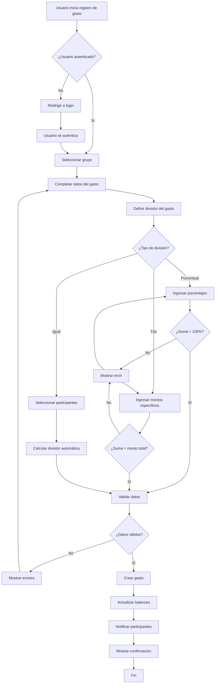
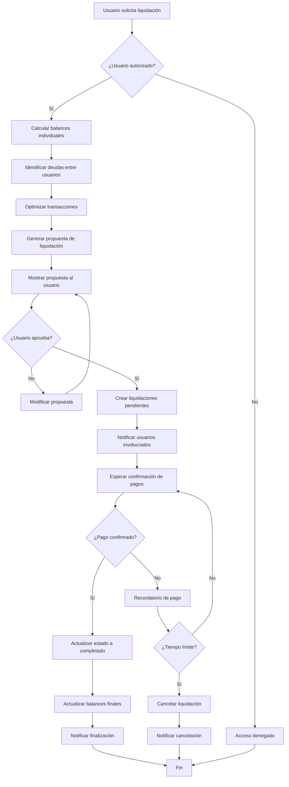

# Análisis de Negocio - Splitia
## Aplicación de División de Gastos Compartidos

---

## 1. DESCRIPCIÓN DE LA ORGANIZACIÓN OBJETIVO

### 1.1 Contexto del Negocio
**Splitia** es una aplicación web diseñada para facilitar la gestión y división de gastos compartidos entre grupos de personas. La organización se enfoca en resolver el problema común de dividir gastos de manera justa y transparente en situaciones como:

- **Viajes grupales**: Hoteles, comidas, transporte, actividades
- **Vida en compartida**: Alquiler, servicios, compras del hogar
- **Eventos sociales**: Fiestas, cenas, actividades recreativas
- **Proyectos colaborativos**: Materiales, herramientas, recursos compartidos

### 1.2 Misión
Proporcionar una plataforma intuitiva y confiable que permita a las personas dividir gastos de manera equitativa, mantener un registro transparente de las deudas y facilitar los reembolsos entre miembros del grupo.

### 1.3 Visión
Ser la aplicación líder en gestión de gastos compartidos, reconocida por su simplicidad, precisión y capacidad de adaptarse a diferentes tipos de grupos y situaciones.

### 1.4 Objetivos Estratégicos
- **Transparencia**: Mantener registros claros y auditables de todos los gastos
- **Equidad**: Permitir diferentes tipos de división (igual, porcentual, fijo)
- **Eficiencia**: Automatizar cálculos y recordatorios de pagos
- **Colaboración**: Facilitar la comunicación entre miembros del grupo
- **Flexibilidad**: Adaptarse a diferentes monedas y preferencias culturales

---

## 2. ACTORES DEL NEGOCIO

### 2.1 Actores Principales

#### **Usuario Registrado**
- **Descripción**: Persona que se registra en la plataforma para gestionar sus gastos compartidos
- **Responsabilidades**:
  - Crear y gestionar grupos de gastos
  - Registrar gastos realizados
  - Definir cómo se dividen los gastos
  - Realizar y recibir pagos de liquidación
  - Comunicarse con otros miembros del grupo

#### **Miembro de Grupo**
- **Descripción**: Usuario que participa en un grupo de gastos compartidos
- **Responsabilidades**:
  - Ver gastos del grupo
  - Confirmar su participación en gastos
  - Realizar pagos cuando corresponda
  - Comunicarse con otros miembros

### 2.2 Actores Secundarios

#### **Administrador del Sistema**
- **Descripción**: Personal técnico que mantiene la plataforma
- **Responsabilidades**:
  - Mantener la infraestructura
  - Resolver problemas técnicos
  - Gestionar la base de datos
  - Implementar mejoras

#### **Sistema de Pagos**
- **Descripción**: Integración con servicios de pago externos
- **Responsabilidades**:
  - Procesar transacciones
  - Validar pagos
  - Generar comprobantes

---

## 3. CASOS DE USO DEL NEGOCIO

### 3.1 Gestión de Usuarios
- **UC-001**: Registro de nuevo usuario
- **UC-002**: Autenticación de usuario
- **UC-003**: Gestión de perfil de usuario
- **UC-004**: Configuración de preferencias

### 3.2 Gestión de Grupos
- **UC-005**: Crear nuevo grupo
- **UC-006**: Invitar usuarios a grupo
- **UC-007**: Aceptar invitación a grupo
- **UC-008**: Gestionar miembros del grupo
- **UC-009**: Configurar roles de grupo

### 3.3 Gestión de Gastos
- **UC-010**: Registrar nuevo gasto
- **UC-011**: Editar gasto existente
- **UC-012**: Eliminar gasto
- **UC-013**: Categorizar gastos
- **UC-014**: Definir división de gastos

### 3.4 Liquidaciones y Pagos
- **UC-015**: Calcular balances del grupo
- **UC-016**: Generar propuesta de liquidación
- **UC-017**: Registrar pago de liquidación
- **UC-018**: Confirmar recepción de pago
- **UC-019**: Generar reportes de deudas

### 3.5 Comunicación
- **UC-020**: Enviar mensaje en grupo
- **UC-021**: Ver historial de mensajes
- **UC-022**: Marcar mensajes como leídos

### 3.6 Presupuestos y Reportes
- **UC-023**: Crear presupuesto mensual
- **UC-024**: Ver reportes de gastos
- **UC-025**: Exportar datos financieros

---

## 4. DIAGRAMA DE CASOS DE USO DEL NEGOCIO

```mermaid
graph TB
    %% Actores
    Usuario[👤 Usuario Registrado]
    Miembro[👥 Miembro de Grupo]
    Admin[⚙️ Administrador]
    SistemaPagos[💳 Sistema de Pagos]

    %% Casos de uso - Gestión de Usuarios
    subgraph "Gestión de Usuarios"
        UC001[UC-001: Registro de Usuario]
        UC002[UC-002: Autenticación]
        UC003[UC-003: Gestión de Perfil]
        UC004[UC-004: Configurar Preferencias]
    end

    %% Casos de uso - Gestión de Grupos
    subgraph "Gestión de Grupos"
        UC005[UC-005: Crear Grupo]
        UC006[UC-006: Invitar Usuarios]
        UC007[UC-007: Aceptar Invitación]
        UC008[UC-008: Gestionar Miembros]
        UC009[UC-009: Configurar Roles]
    end

    %% Casos de uso - Gestión de Gastos
    subgraph "Gestión de Gastos"
        UC010[UC-010: Registrar Gasto]
        UC011[UC-011: Editar Gasto]
        UC012[UC-012: Eliminar Gasto]
        UC013[UC-013: Categorizar Gastos]
        UC014[UC-014: Definir División]
    end

    %% Casos de uso - Liquidaciones
    subgraph "Liquidaciones y Pagos"
        UC015[UC-015: Calcular Balances]
        UC016[UC-016: Generar Liquidación]
        UC017[UC-017: Registrar Pago]
        UC018[UC-018: Confirmar Pago]
        UC019[UC-019: Reportes de Deudas]
    end

    %% Casos de uso - Comunicación
    subgraph "Comunicación"
        UC020[UC-020: Enviar Mensaje]
        UC021[UC-021: Ver Historial]
        UC022[UC-022: Marcar Leídos]
    end

    %% Casos de uso - Reportes
    subgraph "Presupuestos y Reportes"
        UC023[UC-023: Crear Presupuesto]
        UC024[UC-024: Ver Reportes]
        UC025[UC-025: Exportar Datos]
    end

    %% Relaciones Usuario
    Usuario --> UC001
    Usuario --> UC002
    Usuario --> UC003
    Usuario --> UC004
    Usuario --> UC005
    Usuario --> UC006
    Usuario --> UC010
    Usuario --> UC011
    Usuario --> UC012
    Usuario --> UC013
    Usuario --> UC014
    Usuario --> UC015
    Usuario --> UC016
    Usuario --> UC017
    Usuario --> UC020
    Usuario --> UC023
    Usuario --> UC024
    Usuario --> UC025

    %% Relaciones Miembro
    Miembro --> UC007
    Miembro --> UC010
    Miembro --> UC011
    Miembro --> UC015
    Miembro --> UC017
    Miembro --> UC018
    Miembro --> UC020
    Miembro --> UC021
    Miembro --> UC022
    Miembro --> UC024

    %% Relaciones Sistema
    SistemaPagos --> UC017
    SistemaPagos --> UC018
    Admin --> UC008
    Admin --> UC009
```



---

## 5. TRABAJADORES DEL NEGOCIO

### 5.1 Trabajadores Principales

#### **Gestor de Gastos**
- **Responsabilidad**: Gestionar el ciclo completo de gastos compartidos
- **Tareas**:
  - Validar la creación de gastos
  - Calcular divisiones equitativas
  - Mantener balances actualizados
  - Generar propuestas de liquidación

#### **Coordinador de Grupos**
- **Responsabilidad**: Administrar la membresía y configuración de grupos
- **Tareas**:
  - Validar invitaciones
  - Gestionar roles y permisos
  - Mantener integridad de datos del grupo
  - Resolver conflictos de membresía

#### **Procesador de Pagos**
- **Responsabilidad**: Gestionar transacciones y liquidaciones
- **Tareas**:
  - Validar pagos
  - Actualizar balances
  - Generar comprobantes
  - Manejar reembolsos

### 5.2 Trabajadores de Soporte

#### **Moderador de Comunicación**
- **Responsabilidad**: Gestionar la comunicación dentro de grupos
- **Tareas**:
  - Validar mensajes
  - Mantener historial
  - Gestionar notificaciones
  - Resolver problemas de comunicación

#### **Analista de Reportes**
- **Responsabilidad**: Generar análisis y reportes financieros
- **Tareas**:
  - Calcular estadísticas
  - Generar reportes personalizados
  - Mantener métricas de uso
  - Proporcionar insights

---

## 6. ENTIDADES DEL NEGOCIO

### 6.1 Entidades Principales

#### **Usuario**
- **Propósito**: Representar a una persona en el sistema
- **Atributos Clave**: ID, email, nombre, preferencias
- **Reglas de Negocio**:
  - Email único en el sistema
  - Debe tener al menos nombre y apellido
  - Moneda y idioma por defecto configurables

#### **Grupo**
- **Propósito**: Agrupar usuarios para compartir gastos
- **Atributos Clave**: ID, nombre, descripción, creador
- **Reglas de Negocio**:
  - Debe tener al menos un miembro
  - El creador es automáticamente administrador
  - Puede tener conversación asociada

#### **Gasto**
- **Propósito**: Representar un gasto compartido
- **Atributos Clave**: ID, monto, descripción, fecha, pagador
- **Reglas de Negocio**:
  - Debe tener monto mayor a cero
  - Debe estar asociado a un grupo
  - Puede tener categoría personalizada

#### **Participación en Gasto (ExpenseShare)**
- **Propósito**: Definir cómo se divide un gasto entre usuarios
- **Atributos Clave**: ID, monto, tipo de división
- **Reglas de Negocio**:
  - Suma de participaciones debe igualar el monto total
  - Tipos: igual, porcentual, fijo
  - Un usuario no puede tener múltiples participaciones en el mismo gasto

### 6.2 Entidades de Soporte

#### **Liquidación (Settlement)**
- **Propósito**: Registrar pagos entre usuarios
- **Atributos Clave**: ID, monto, estado, fecha
- **Reglas de Negocio**:
  - Debe estar entre dos usuarios del mismo grupo
  - Estados: pendiente, confirmado, completado
  - Puede generar un gasto asociado

#### **Presupuesto (Budget)**
- **Propósito**: Establecer límites de gasto por categoría
- **Atributos Clave**: ID, monto, mes, año, categoría
- **Reglas de Negocio**:
  - Único por usuario, mes, año y categoría
  - Puede ser general (sin categoría específica)

#### **Categoría Personalizada**
- **Propósito**: Clasificar gastos según preferencias del usuario
- **Atributos Clave**: ID, nombre, icono, color
- **Reglas de Negocio**:
  - Nombre único por usuario
  - Puede tener icono y color personalizados

---

## 7. DETALLE DE CASOS DE USO DEL NEGOCIO

### UC-010: Registrar Nuevo Gasto

#### **Descripción**
Permite a un usuario registrar un nuevo gasto en un grupo, definiendo el monto, descripción, fecha y cómo se divide entre los miembros.

#### **Actores**
- Usuario registrado (actor principal)
- Miembros del grupo (actores secundarios)

#### **Precondiciones**
- El usuario debe estar autenticado
- El usuario debe ser miembro del grupo
- El grupo debe existir y estar activo

#### **Flujo Principal**
1. El usuario selecciona un grupo
2. El sistema muestra el formulario de nuevo gasto
3. El usuario ingresa:
   - Monto del gasto
   - Descripción
   - Fecha
   - Categoría (opcional)
   - Ubicación (opcional)
   - Notas (opcional)
4. El usuario define la división del gasto:
   - Selecciona participantes
   - Elige tipo de división (igual, porcentual, fijo)
   - Define montos o porcentajes
5. El sistema valida los datos
6. El sistema crea el gasto y las participaciones
7. El sistema actualiza los balances del grupo
8. El sistema notifica a los participantes
9. El sistema muestra confirmación

#### **Flujos Alternativos**
- **4a. División igual**: El sistema divide automáticamente entre todos los participantes
- **4b. División porcentual**: El usuario ingresa porcentajes que deben sumar 100%
- **4c. División fija**: El usuario ingresa montos específicos

#### **Postcondiciones**
- Se crea un nuevo gasto en el grupo
- Se actualizan los balances de todos los participantes
- Se envía notificación a los miembros del grupo

#### **Reglas de Negocio**
- El monto debe ser mayor a cero
- La suma de las participaciones debe igualar el monto total
- Todos los participantes deben ser miembros del grupo
- La fecha no puede ser futura (configurable)

### UC-016: Generar Propuesta de Liquidación

#### **Descripción**
El sistema calcula automáticamente las deudas entre miembros del grupo y genera una propuesta de liquidación optimizada.

#### **Actores**
- Usuario registrado (actor principal)
- Sistema de cálculo (actor secundario)

#### **Precondiciones**
- El usuario debe estar autenticado
- El usuario debe ser miembro del grupo
- El grupo debe tener gastos registrados

#### **Flujo Principal**
1. El usuario solicita generar liquidación para un grupo
2. El sistema calcula los balances individuales
3. El sistema identifica las deudas entre usuarios
4. El sistema optimiza las transacciones (mínimo número de pagos)
5. El sistema genera la propuesta de liquidación
6. El sistema muestra la propuesta al usuario
7. El usuario puede aprobar o modificar la propuesta
8. Si se aprueba, el sistema crea las liquidaciones pendientes

#### **Reglas de Negocio**
- Solo se consideran gastos no liquidados
- Las liquidaciones se optimizan para minimizar transacciones
- Un usuario no puede liquidar consigo mismo
- El monto de liquidación debe ser mayor al mínimo configurado

---

## 8. DIAGRAMA DE CLASES DEL NEGOCIO

```mermaid
classDiagram
    class Usuario {
        +String id
        +String nombre
        +String apellido
        +String email
        +String telefono
        +String moneda
        +String idioma
        +DateTime fechaCreacion
        +DateTime fechaActualizacion
        +registrar()
        +autenticar()
        +actualizarPerfil()
        +configurarPreferencias()
    }

    class Grupo {
        +String id
        +String nombre
        +String descripcion
        +String imagen
        +DateTime fechaCreacion
        +DateTime fechaActualizacion
        +String creadorId
        +crear()
        +invitarUsuario()
        +gestionarMiembros()
        +configurarRoles()
    }

    class Gasto {
        +String id
        +Float monto
        +String descripcion
        +DateTime fecha
        +String categoriaId
        +String moneda
        +String ubicacion
        +String notas
        +Boolean esLiquidacion
        +String pagadorId
        +String grupoId
        +registrar()
        +editar()
        +eliminar()
        +categorizar()
    }

    class ParticipacionGasto {
        +String id
        +Float monto
        +TipoDivision tipo
        +String gastoId
        +String usuarioId
        +definirDivision()
        +calcularMonto()
        +validarDivision()
    }

    class Liquidacion {
        +String id
        +Float monto
        +String moneda
        +String descripcion
        +DateTime fecha
        +EstadoLiquidacion estado
        +TipoLiquidacion tipo
        +String iniciadorId
        +String receptorId
        +String grupoId
        +generar()
        +registrarPago()
        +confirmarPago()
        +cancelar()
    }

    class Presupuesto {
        +String id
        +Float monto
        +Int mes
        +Int año
        +String moneda
        +String usuarioId
        +String categoriaId
        +crear()
        +actualizar()
        +verificarLimite()
        +generarReporte()
    }

    class CategoriaPersonalizada {
        +String id
        +String nombre
        +String icono
        +String color
        +String usuarioId
        +crear()
        +editar()
        +eliminar()
        +validarUnicidad()
    }

    class Conversacion {
        +String id
        +Boolean esGrupoChat
        +String nombre
        +DateTime fechaCreacion
        +DateTime fechaActualizacion
        +String grupoId
        +crear()
        +agregarParticipante()
        +enviarMensaje()
    }

    class Mensaje {
        +String id
        +String contenido
        +Boolean esAI
        +DateTime fechaCreacion
        +DateTime fechaActualizacion
        +String conversacionId
        +String remitenteId
        +enviar()
        +editar()
        +eliminar()
        +marcarComoLeido()
    }

    %% Relaciones
    Usuario ||--o{ Grupo : crea
    Usuario ||--o{ Gasto : paga
    Usuario ||--o{ ParticipacionGasto : participa
    Usuario ||--o{ Liquidacion : inicia
    Usuario ||--o{ Liquidacion : recibe
    Usuario ||--o{ Presupuesto : tiene
    Usuario ||--o{ CategoriaPersonalizada : posee
    Usuario ||--o{ Mensaje : envía

    Grupo ||--o{ Gasto : contiene
    Grupo ||--o{ Liquidacion : incluye
    Grupo ||--o{ Conversacion : tiene

    Gasto ||--o{ ParticipacionGasto : divide
    Gasto ||--o{ Liquidacion : genera
    Gasto }o--|| CategoriaPersonalizada : categoriza

    Conversacion ||--o{ Mensaje : contiene
```

---

## 9. DIAGRAMA DE ACTIVIDADES DEL NEGOCIO

### 9.1 Proceso de Registro de Gasto



### 9.2 Proceso de Liquidación de Deudas



---

## 10. REGLAS DE NEGOCIO

### 10.1 Reglas de Usuario

#### **RB-001: Unicidad de Email**
- **Descripción**: Cada usuario debe tener un email único en el sistema
- **Prioridad**: Crítica
- **Validación**: Al registrar y actualizar perfil
- **Excepción**: Ninguna

#### **RB-002: Datos Mínimos de Usuario**
- **Descripción**: Un usuario debe tener al menos nombre, apellido y email
- **Prioridad**: Alta
- **Validación**: Al crear cuenta
- **Excepción**: Ninguna

#### **RB-003: Configuración de Moneda**
- **Descripción**: Cada usuario tiene una moneda por defecto (PEN)
- **Prioridad**: Media
- **Validación**: Al crear cuenta y cambiar preferencias
- **Excepción**: Puede usar diferentes monedas por gasto

### 10.2 Reglas de Grupo

#### **RB-004: Membresía Mínima**
- **Descripción**: Un grupo debe tener al menos un miembro
- **Prioridad**: Alta
- **Validación**: Al crear grupo y eliminar miembros
- **Excepción**: El creador no puede ser eliminado

#### **RB-005: Rol del Creador**
- **Descripción**: El creador del grupo es automáticamente administrador
- **Prioridad**: Alta
- **Validación**: Al crear grupo
- **Excepción**: Puede transferir administración

#### **RB-006: Invitaciones Únicas**
- **Descripción**: Un usuario no puede ser invitado dos veces al mismo grupo
- **Prioridad**: Media
- **Validación**: Al enviar invitación
- **Excepción**: Si la invitación anterior expiró

### 10.3 Reglas de Gastos

#### **RB-007: Monto Positivo**
- **Descripción**: El monto de un gasto debe ser mayor a cero
- **Prioridad**: Crítica
- **Validación**: Al crear y editar gastos
- **Excepción**: Ninguna

#### **RB-008: División Completa**
- **Descripción**: La suma de las participaciones debe igualar el monto total del gasto
- **Prioridad**: Crítica
- **Validación**: Al crear y editar gastos
- **Excepción**: Tolerancia de 0.01 para redondeo

#### **RB-009: Participación Única**
- **Descripción**: Un usuario no puede tener múltiples participaciones en el mismo gasto
- **Prioridad**: Alta
- **Validación**: Al definir divisiones
- **Excepción**: Ninguna

#### **RB-010: Fecha de Gasto**
- **Descripción**: La fecha del gasto no puede ser futura
- **Prioridad**: Media
- **Validación**: Al crear gastos
- **Excepción**: Configurable por grupo

### 10.4 Reglas de Liquidaciones

#### **RB-011: Liquidación Entre Miembros**
- **Descripción**: Las liquidaciones solo pueden ser entre miembros del mismo grupo
- **Prioridad**: Crítica
- **Validación**: Al crear liquidaciones
- **Excepción**: Ninguna

#### **RB-012: Auto-liquidación**
- **Descripción**: Un usuario no puede liquidar consigo mismo
- **Prioridad**: Alta
- **Validación**: Al generar propuestas de liquidación
- **Excepción**: Ninguna

#### **RB-013: Monto Mínimo de Liquidación**
- **Descripción**: Las liquidaciones menores a $1.00 se ignoran automáticamente
- **Prioridad**: Media
- **Validación**: Al generar propuestas
- **Excepción**: Configurable por grupo

#### **RB-014: Estados de Liquidación**
- **Descripción**: Las liquidaciones siguen el flujo: PENDIENTE → CONFIRMADO → COMPLETADO
- **Prioridad**: Alta
- **Validación**: En cada cambio de estado
- **Excepción**: Pueden cancelarse en cualquier estado

### 10.5 Reglas de Presupuestos

#### **RB-015: Unicidad de Presupuesto**
- **Descripción**: Un usuario puede tener solo un presupuesto por mes, año y categoría
- **Prioridad**: Media
- **Validación**: Al crear presupuestos
- **Excepción**: Puede actualizar el existente

#### **RB-016: Presupuesto General**
- **Descripción**: Un usuario puede tener un presupuesto general sin categoría específica
- **Prioridad**: Baja
- **Validación**: Al crear presupuestos
- **Excepción**: Ninguna

### 10.6 Reglas de Categorías

#### **RB-017: Unicidad de Categoría**
- **Descripción**: Un usuario no puede tener dos categorías con el mismo nombre
- **Prioridad**: Media
- **Validación**: Al crear y editar categorías
- **Excepción**: Diferentes usuarios pueden tener categorías con el mismo nombre

#### **RB-018: Categorías en Uso**
- **Descripción**: No se pueden eliminar categorías que tienen gastos asociados
- **Prioridad**: Alta
- **Validación**: Al intentar eliminar categoría
- **Excepción**: Se puede reasignar gastos a otra categoría

### 10.7 Reglas de Comunicación

#### **RB-019: Mensajes en Grupo**
- **Descripción**: Solo los miembros del grupo pueden enviar mensajes
- **Prioridad**: Alta
- **Validación**: Al enviar mensajes
- **Excepción**: Los administradores pueden moderar

#### **RB-020: Historial de Mensajes**
- **Descripción**: Los mensajes se mantienen por 90 días
- **Prioridad**: Baja
- **Validación**: Proceso automático de limpieza
- **Excepción**: Configurable por grupo

### 10.8 Reglas de Seguridad

#### **RB-021: Autenticación Requerida**
- **Descripción**: Todas las operaciones requieren autenticación
- **Prioridad**: Crítica
- **Validación**: En cada solicitud
- **Excepción**: Registro y login

#### **RB-022: Autorización por Rol**
- **Descripción**: Los administradores de grupo tienen permisos adicionales
- **Prioridad**: Alta
- **Validación**: En operaciones sensibles
- **Excepción**: Operaciones básicas disponibles para todos

#### **RB-023: Auditoría de Cambios**
- **Descripción**: Todos los cambios importantes se registran con timestamp y usuario
- **Prioridad**: Media
- **Validación**: Automática en operaciones CRUD
- **Excepción**: Operaciones de solo lectura

### 10.9 Reglas de Integridad de Datos

#### **RB-024: Consistencia de Balances**
- **Descripción**: Los balances del grupo deben ser consistentes con los gastos y liquidaciones
- **Prioridad**: Crítica
- **Validación**: Automática después de cada operación
- **Excepción**: Ninguna

#### **RB-025: Eliminación en Cascada**
- **Descripción**: Al eliminar un grupo, se eliminan todos sus gastos y liquidaciones
- **Prioridad**: Alta
- **Validación**: Al eliminar grupo
- **Excepción**: Se puede hacer backup antes de eliminar

#### **RB-026: Referencias Válidas**
- **Descripción**: Todas las referencias foráneas deben apuntar a registros existentes
- **Prioridad**: Crítica
- **Validación**: En cada operación de base de datos
- **Excepción**: Ninguna

---

## CONCLUSIÓN

Este análisis de negocio proporciona una base sólida para el desarrollo de Splitia, definiendo claramente:

1. **El contexto y objetivos** de la aplicación
2. **Los actores y sus responsabilidades** en el sistema
3. **Los casos de uso principales** que debe soportar
4. **La estructura de clases** que modela el dominio
5. **Los procesos de negocio** más importantes
6. **Las reglas de negocio** que garantizan la integridad y consistencia

Estas especificaciones servirán como guía para el desarrollo, testing y mantenimiento de la aplicación, asegurando que cumpla con los requisitos del negocio y proporcione una experiencia de usuario óptima.
