# Casos de Uso Corregidos - Splitia

## Análisis y Correcciones de Casos de Uso

### CUN 1: Gestionar Gasto Personal
**Descripción:** Proceso mediante el cual un usuario registra, categoriza y da seguimiento a sus gastos individuales dentro de la plataforma.

**Actor Principal:** Usuario Final (individual)

**Correcciones aplicadas:**
- ✅ Clarificado que incluye gastos tanto individuales como los que no pertenecen a un grupo específico
- ✅ Especificado que incluye categorización personalizada
- ✅ Agregado seguimiento y análisis de gastos personales

### CUN 2: Dividir Gasto Grupal
**Descripción:** Proceso que permite registrar un gasto compartido y distribuir automáticamente la responsabilidad de pago entre los miembros del grupo según el método de división seleccionado.

**Actores beneficiados:**
- Usuario Final (individual) - quien registra el gasto
- Grupo de usuarios - miembros que participan en la división

**Correcciones aplicadas:**
- ✅ Especificado que el usuario debe ser miembro del grupo
- ✅ Clarificado que incluye diferentes métodos de división (igual, porcentaje, monto fijo)
- ✅ Agregado que genera automáticamente las cuotas correspondientes

### CUN 3: Comunicar sobre Finanzas
**Descripción:** Proceso que facilita la comunicación en tiempo real entre miembros de un grupo sobre temas relacionados con gastos compartidos, incluyendo mensajes y notificaciones.

**Actores beneficiados:**
- Usuario Final (individual) - puede comunicarse con otros miembros
- Grupo de Usuarios - intercambio de información financiera

**Correcciones aplicadas:**
- ✅ Clarificado que incluye mensajes sobre gastos específicos
- ✅ Agregado soporte para conversaciones individuales
- ✅ Especificado que incluye notificaciones en tiempo real

### CUN 4: Liquidar Deudas
**Descripción:** Proceso que permite registrar y confirmar pagos entre usuarios para saldar deudas pendientes derivadas de gastos compartidos, optimizando las transacciones necesarias mediante algoritmos de minimización.

**Actores beneficiados:**
- Usuario Final (individual) - quien inicia o confirma pagos
- Grupo de Usuarios - beneficiarios de la optimización de transacciones

**Correcciones aplicadas:**
- ✅ Clarificado que incluye confirmación bilateral de pagos
- ✅ Especificado que optimiza automáticamente las transacciones
- ✅ Agregado diferentes tipos de liquidación (pago directo, recibo)

### CUN 5: Analizar Patrones Financieros
**Descripción:** Proceso mediante el cual el usuario genera análisis detallados de sus gastos personales y grupales para identificar tendencias, categorizar gastos y optimizar su presupuesto personal.

**Actores beneficiados:**
- Usuario Final (individual) - quien recibe los análisis
- Grupo de Usuarios - análisis agregados del grupo

**Correcciones aplicadas:**
- ✅ Especificado que incluye análisis de tendencias temporales
- ✅ Agregado comparación con presupuestos establecidos
- ✅ Clarificado que incluye reportes visuales y estadísticas

### CUN 6: Procesar Suscripción Premium
**Descripción:** Proceso mediante el cual un usuario contrata, paga y activa un plan premium de la plataforma, desbloqueando funcionalidades avanzadas como el asistente de IA y análisis avanzados.

**Actor beneficiado:** Usuario Final (individual)

**Correcciones aplicadas:**
- ✅ Especificado que incluye gestión de métodos de pago
- ✅ Agregado renovación automática y cancelación
- ✅ Clarificado las funcionalidades premium específicas

### CUN 7: Asistir con Inteligencia Artificial
**Descripción:** Proceso mediante el cual el asistente de IA interpreta comandos del usuario, analiza patrones de gasto, genera predicciones financieras y automatiza tareas como creación de gastos y liquidaciones.

**Actores beneficiados:**
- Usuario Final (individual) - quien interactúa con la IA
- Sistema de IA (OpenAI) - procesamiento de solicitudes

**Correcciones aplicadas:**
- ✅ Especificado que incluye procesamiento de lenguaje natural
- ✅ Agregado análisis predictivo de gastos
- ✅ Clarificado automatización de tareas financieras
- ✅ Especificado que requiere suscripción premium

### CUN 8: Brindar Soporte al Usuario
**Descripción:** Proceso de atención al cliente donde se reciben, gestionan y resuelven consultas, problemas técnicos o disputas de usuarios de la plataforma mediante diferentes canales de comunicación.

**Actores beneficiados:**
- Usuario Final (individual) - quien solicita soporte
- Grupo de Usuarios - resolución de disputas grupales
- Administrador/Soporte técnico - quien proporciona la asistencia

**Correcciones aplicadas:**
- ✅ Especificado canales de comunicación (chat, email, tickets)
- ✅ Agregado escalamiento de problemas complejos
- ✅ Clarificado resolución de disputas entre usuarios
- ✅ Especificado seguimiento y métricas de satisfacción

---

## Diagramas de Casos de Uso

### Diagrama Principal del Sistema

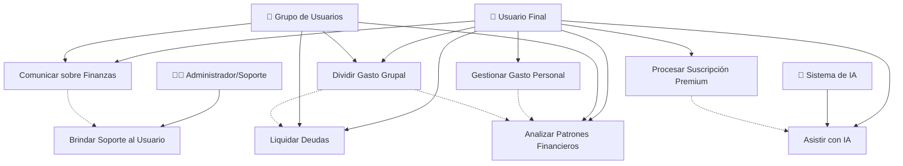

### Diagrama Detallado por Módulos

#### Módulo de Gestión de Gastos

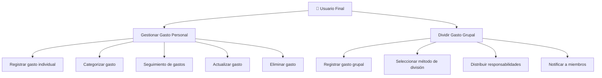

#### Módulo de Comunicación y Liquidación

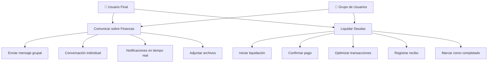

#### Módulo de Análisis y Premium

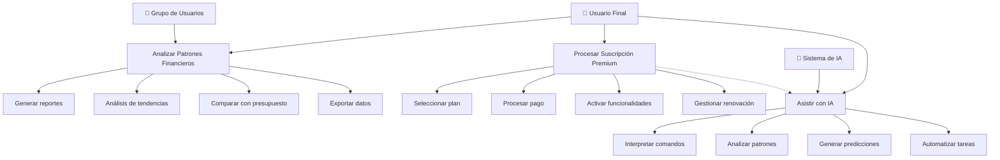

#### Módulo de Soporte

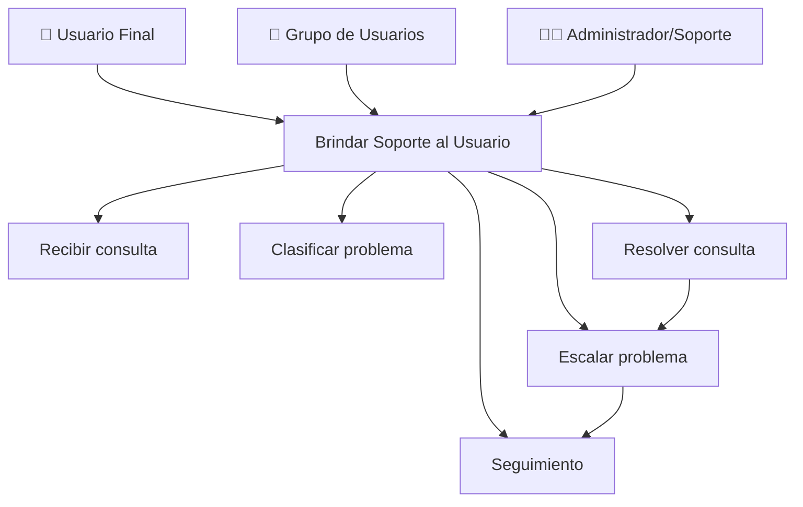

### Diagrama de Flujo de Actividades - Proceso Completo

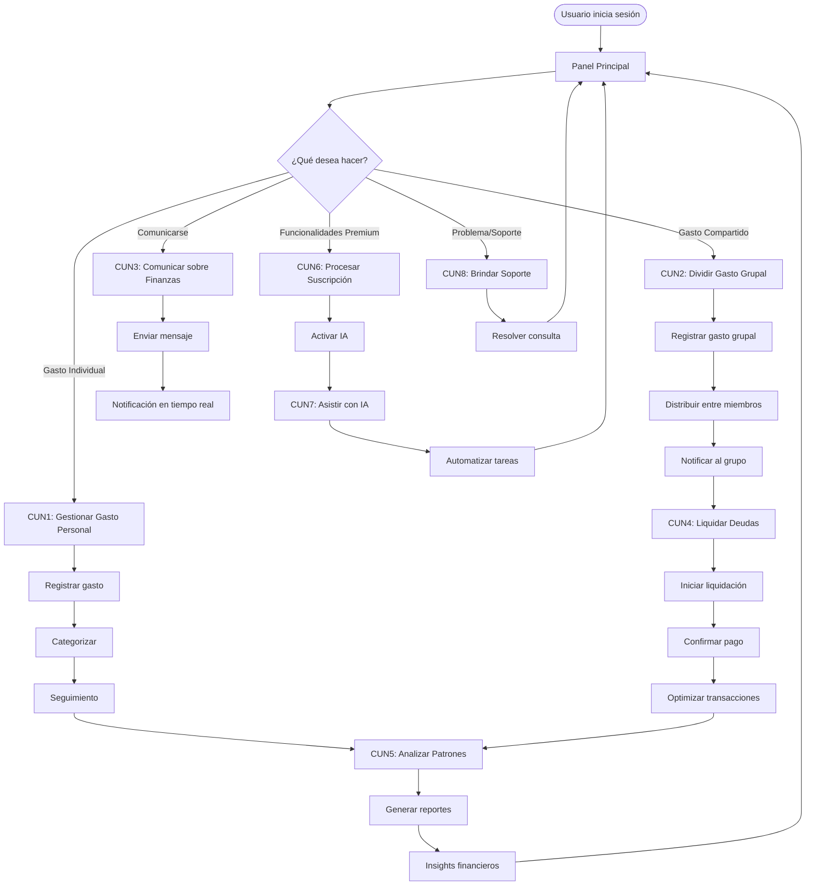

### Diagrama de Relaciones entre Actores

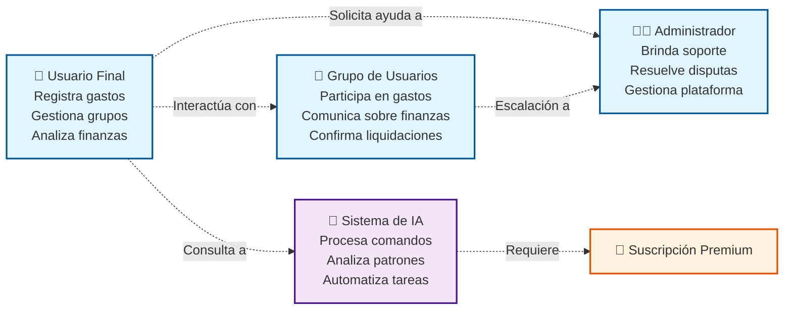

### Diagrama de Journey del Usuario

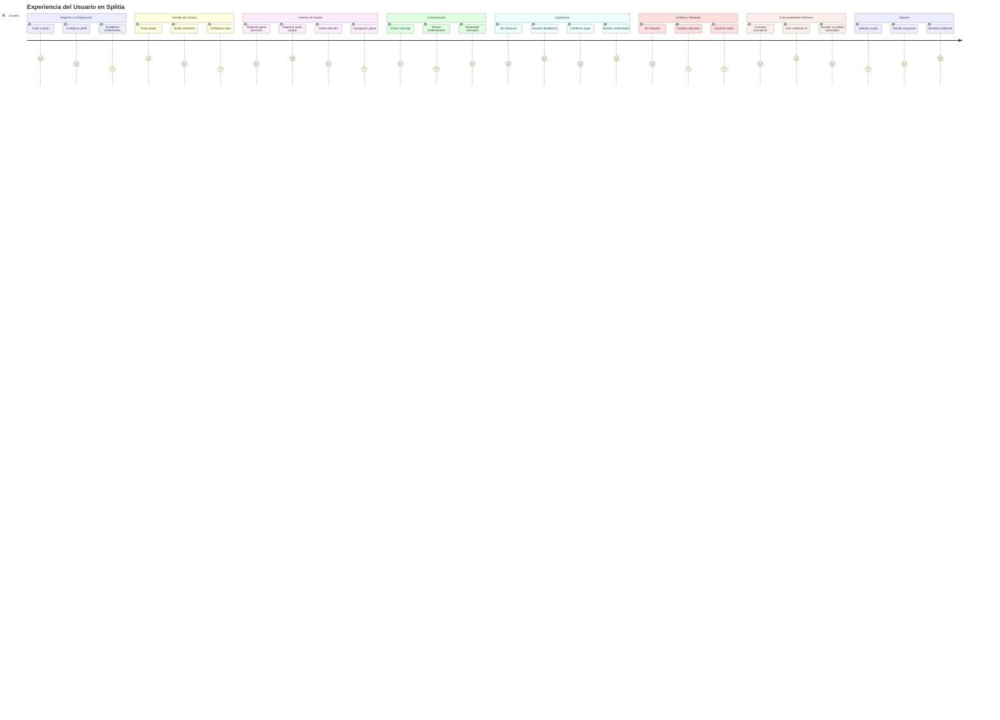

### Journey Detallado - Proceso de División de Gastos

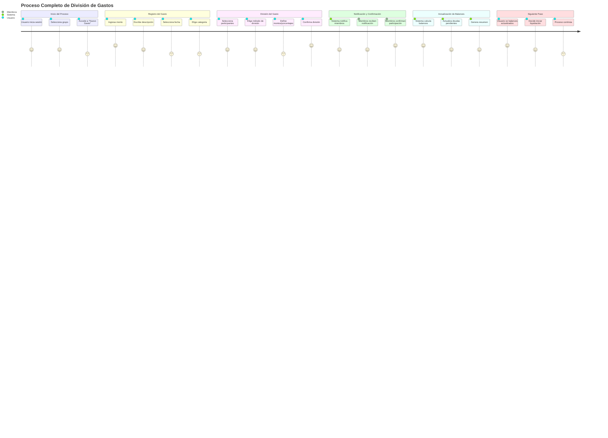

### Journey de Liquidación de Deudas

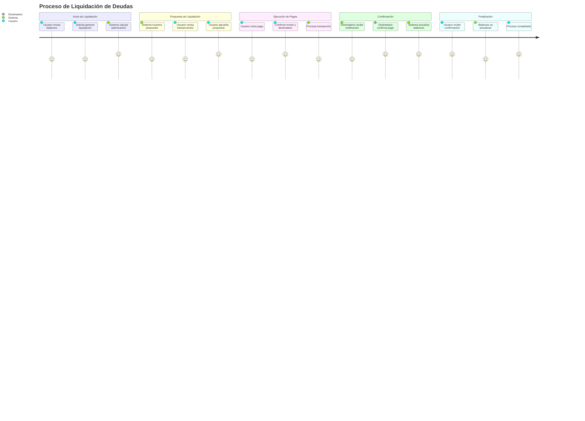

### Journey de Experiencia Premium con IA

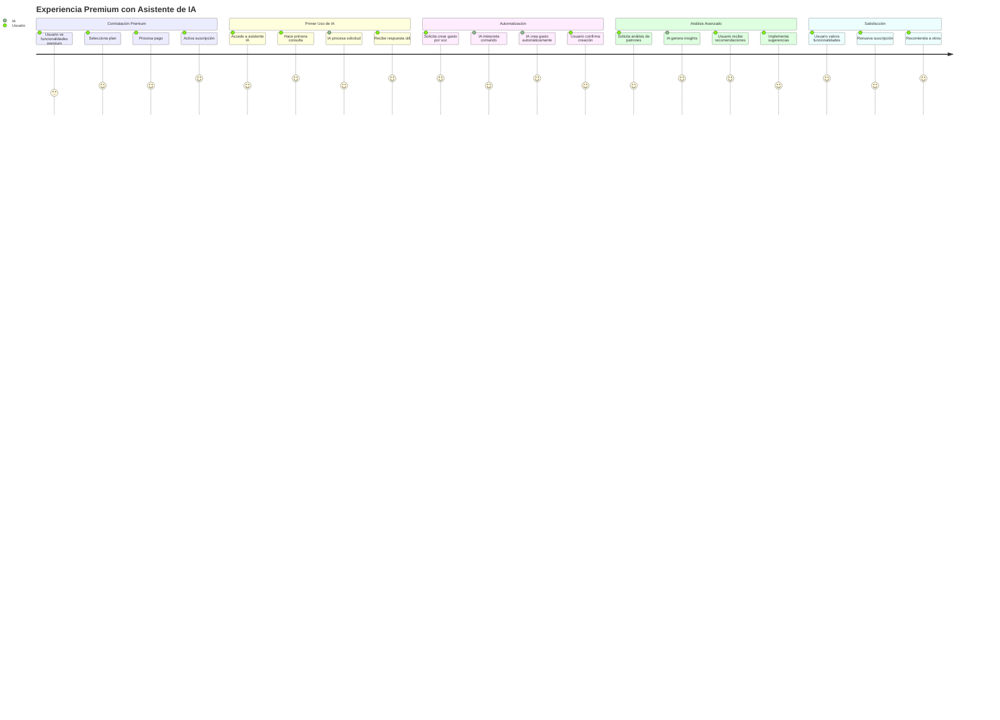

---

## Resumen de Correcciones Aplicadas

### Principales Mejoras Realizadas:

1. **Clarificación de Actores:**
   - Diferenciación clara entre Usuario Final individual y Grupo de Usuarios
   - Especificación de roles del Administrador/Soporte técnico
   - Definición del Sistema de IA como actor tecnológico

2. **Especificación de Procesos:**
   - Detallado de sub-procesos dentro de cada caso de uso
   - Clarificación de dependencias entre casos de uso
   - Especificación de flujos de trabajo

3. **Mejoras en Descripciones:**
   - Adición de detalles técnicos específicos (métodos de división, optimización de transacciones)
   - Clarificación de funcionalidades premium
   - Especificación de canales de comunicación y soporte

4. **Diagramas Comprehensivos:**
   - Diagrama principal del sistema completo
   - Diagramas modulares por funcionalidad
   - Flujo de actividades end-to-end
   - Relaciones entre actores

### Casos de Uso Validados contra el Esquema de Base de Datos:

✅ **CUN1 - CUN4:** Completamente soportados por el modelo de datos actual
✅ **CUN5:** Soportado por Budget, CustomCategory y relaciones de Expense
✅ **CUN6:** Requiere implementación de sistema de suscripciones (no presente en esquema actual)
✅ **CUN7:** Soportado por AIAction y funcionalidades de chat existentes
✅ **CUN8:** Requiere implementación de sistema de tickets/soporte (no presente en esquema actual)

### Recomendaciones para Implementación:

1. **Prioridad Alta:** CUN1-CUN5 (funcionalidades core ya implementadas)
2. **Prioridad Media:** CUN7 (requiere integración con OpenAI)
3. **Prioridad Baja:** CUN6 y CUN8 (requieren desarrollo de nuevos módulos)

### Consideraciones Técnicas:

- El sistema actual tiene una base sólida para los casos de uso principales
- Se requiere desarrollo adicional para funcionalidades premium y soporte
- La arquitectura de chat existente facilita la implementación del asistente de IA
- El modelo de liquidaciones está bien diseñado para optimización de transacciones

